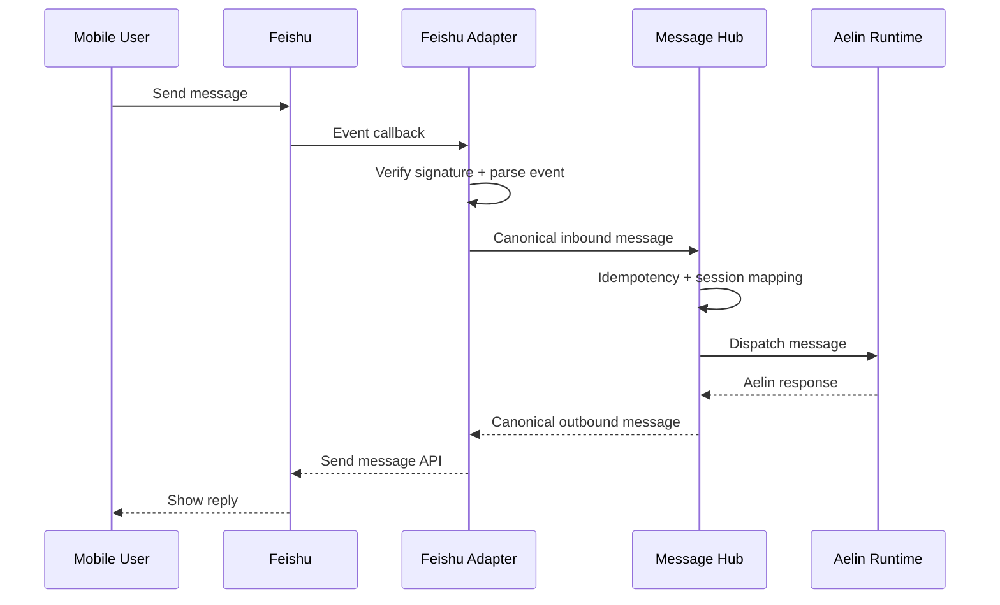
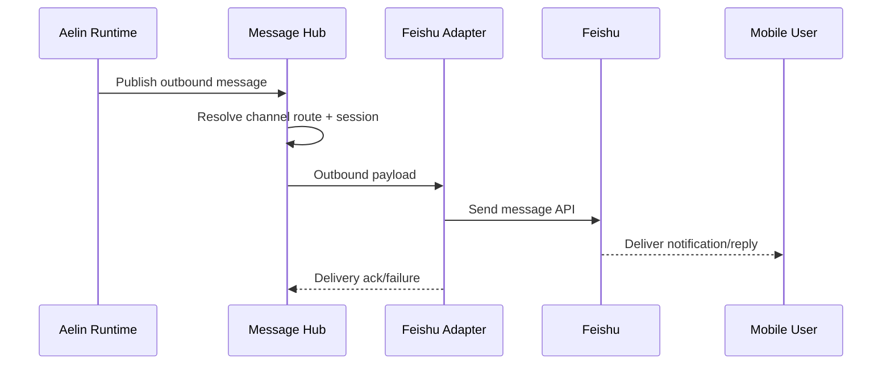

# Mobile <-> Aelin Message Bridge (Feishu)

## 1. 背景

当前阶段目标不是“手机控制电脑”，而是先打通一条稳定的双向通信通路：

1. 移动端可以通过飞书向 Aelin 发送消息，效果与桌面端发送消息一致。
2. Aelin 可以通过飞书把消息回给同一用户。
3. 未来新增渠道（Web、微信、Telegram、桌面内置 IM）时，不需要改 Aelin 核心流程。

## 2. 范围与非目标

### 2.1 范围（In Scope）

1. 飞书作为首个移动端入口渠道。
2. `用户 -> Aelin` 与 `Aelin -> 用户` 的双向消息闭环。
3. 会话关联、消息去重、错误重试、可观测性与审计日志。
4. 对 Aelin 统一暴露标准消息协议，不暴露渠道细节。

### 2.2 非目标（Out of Scope）

1. 电脑远程控制（鼠标、键盘、屏幕流）。
2. 任意命令执行与系统操作编排。
3. 多媒体实时流通道（语音通话、远程桌面）。
4. 跨组织复杂权限体系（当前先单租户/单团队）。

## 3. 成功标准（MVP）

1. 手机飞书发送文本消息，Aelin 在 3 秒内收到并开始处理。
2. Aelin 回复可在同一飞书会话中回到发起用户。
3. 同一用户连续 10 轮对话不串会话。
4. 重复事件不会被重复处理（幂等生效）。
5. 任何失败可追踪：谁发了什么、何时失败、失败原因是什么。

## 4. 总体架构

```text
Mobile User
   |
Feishu Client
   |
Feishu Platform (Webhook/Event)
   |
Feishu Adapter  --->  Message Hub  --->  Aelin Runtime
     ^                    |                  |
     |                    |                  v
     +----- Outbound Router <--- Aelin Response/Event
```

### 4.1 组件职责

#### Feishu Adapter

- 接收飞书事件回调并验签。
- 将飞书事件转成统一消息协议（Canonical Message）。
- 将出站消息转换为飞书 API 请求并发送。

#### Message Hub

- 做消息标准化、幂等去重、会话映射、路由分发。
- 屏蔽渠道差异，给 Aelin 提供统一输入输出。

#### Session Mapper

- 维护 `channel + channel_user_id -> aelin_user_id + session_id` 映射。
- 保证多轮对话上下文稳定，不串用户。

#### Aelin Runtime

- 只处理统一消息，不感知“消息来自飞书还是桌面”。
- 输出统一回复消息，交由 Router 回发。

#### Outbound Router

- 按 `channel` 选择对应 Adapter 发送。
- 管理重试、限流、失败落盘与告警。

## 5. 时序设计

### 5.1 入站时序（移动端 -> Aelin）



### 5.2 出站时序（Aelin -> 用户）



## 6. 统一消息协议（Canonical Message）

```json
{
  "message_id": "01HZY4X8K2P0Z2WQ6T6P8Y2G3A",
  "direction": "inbound",
  "channel": "feishu",
  "channel_message_id": "om_xxx",
  "channel_user_id": "ou_xxx",
  "aelin_user_id": "user_123",
  "session_id": "sess_abc123",
  "trace_id": "trace_20260305_001",
  "dedupe_key": "feishu:tenant_x:event_x",
  "content": {
    "type": "text",
    "text": "今天帮我总结下昨天的会议纪要"
  },
  "metadata": {
    "tenant_key": "tenant_x",
    "chat_type": "p2p",
    "operator": "ou_xxx"
  },
  "created_at": "2026-03-05T09:30:00Z"
}
```

### 6.1 字段约束

1. `message_id`：系统生成全局唯一 ID（建议 ULID）。
2. `direction`：`inbound` 或 `outbound`。
3. `channel`：当前固定为 `feishu`，后续可扩展。
4. `dedupe_key`：用于幂等，必须可由渠道事件唯一确定。
5. `session_id`：会话键，保持多轮上下文一致。
6. `trace_id`：全链路追踪 ID，日志与监控统一引用。

## 7. 会话与身份映射

### 7.1 映射键

1. 主键建议：`tenant_key + channel + channel_user_id`。
2. 映射结果：`aelin_user_id + session_id + last_active_at`。
3. TTL 建议：会话 24 小时滑动续期，可配置。

### 7.2 新会话创建规则

1. 首次见到 `channel_user_id` 时创建 `aelin_user_id` 与默认 `session_id`。
2. 如果用户显式触发“新对话”，重置 `session_id`。
3. 若超时过久，可自动轮转会话，保留历史链路。

## 8. 接口契约（建议）

### 8.1 飞书入站回调

- `POST /api/v1/inbound/feishu/events`
- 责任：验签、事件解析、转换为 Canonical Message。

响应：

```json
{
  "ok": true,
  "accepted": true,
  "message_id": "01HZY4X8K2P0Z2WQ6T6P8Y2G3A"
}
```

### 8.2 Hub 入站接入（内部）

- `POST /api/v1/hub/messages/inbound`
- 责任：幂等、会话映射、分发给 Aelin。

### 8.3 Hub 出站发布（内部）

- `POST /api/v1/hub/messages/outbound`
- 责任：按 channel 路由到对应 Adapter。

### 8.4 飞书出站发送

- `POST /api/v1/integrations/feishu/send`（内部服务调用）
- 责任：调用飞书消息发送 API，记录发送结果与错误码。

## 9. 安全设计

1. 飞书回调验签：校验签名、时间戳窗口、应用标识。
2. 服务间鉴权：Hub/Adapter 使用内部 token 或 mTLS。
3. 密钥管理：飞书 app secret 存放在环境变量或密钥管理服务。
4. 数据脱敏：日志默认脱敏用户标识与内容中的敏感字段。
5. 最小权限：飞书应用只申请消息收发所需最小权限。

## 10. 可靠性设计

1. 投递语义：至少一次（at-least-once）+ 幂等去重。
2. 去重策略：基于 `dedupe_key`，默认保留 24 小时。
3. 重试策略：指数退避（1s / 5s / 15s / 30s / 60s），上限 5 次。
4. 死信队列：超过重试上限进入 DLQ，触发告警。
5. 限流策略：按渠道用户与租户做速率限制，避免刷屏与雪崩。

## 11. 可观测性与审计

### 11.1 监控指标

1. `inbound_qps`、`outbound_qps`
2. `end_to_end_latency_ms`（p50/p95/p99）
3. `outbound_success_rate`
4. `dedupe_hit_rate`
5. `retry_count`、`dlq_count`

### 11.2 审计日志

1. `who`：渠道用户标识与映射后的 Aelin 用户。
2. `when`：入站时间、处理时间、出站时间。
3. `what`：消息摘要与长度，不强制存全文。
4. `result`：成功/失败/错误码/重试次数。

## 12. 实施计划

### 阶段 1：MVP（1 周）

1. 打通飞书入站回调验签与文本消息解析。
2. 实现 Canonical Message、幂等去重、会话映射。
3. 接入 Aelin Runtime 的基础问答接口。
4. 实现飞书出站回发与基础失败重试。

交付物：

1. 端到端双向链路可用。
2. 基础日志与链路追踪字段齐全。
3. MVP 验收用例通过。

### 阶段 2：稳定性增强（1 周）

1. 增加 DLQ、告警、重试策略可配置。
2. 增加限流与内容保护（超长/空消息/非法格式）。
3. 增加回放工具（按 `trace_id` 重放链路）。

交付物：

1. 可靠性指标看板。
2. 故障处理 Runbook。

### 阶段 3：多渠道扩展（按需）

1. 抽象 Adapter 接口（Feishu/Desktop/其他 IM）。
2. 新渠道仅实现 Adapter，不改 Hub 与 Aelin 主链路。

## 13. 风险与缓解

1. 风险：飞书回调抖动或重复投递。缓解：严格幂等键 + 去重缓存 + 审计链路。
2. 风险：渠道限流导致回发失败。缓解：重试退避 + DLQ + 降级为摘要消息。
3. 风险：会话映射错误导致串线。缓解：强约束映射键 + 回归测试 + 手动纠偏接口。

## 14. 验收用例

1. `Case-01` 单轮文本：手机发问，Aelin 回答成功。
2. `Case-02` 多轮上下文：连续 10 轮不串会话。
3. `Case-03` 重复事件：同一事件重复投递，只处理一次。
4. `Case-04` 出站失败：模拟飞书 5xx，重试后成功或进 DLQ。
5. `Case-05` 安全校验：无效签名请求被拒绝。

## 15. 未来演进（与电脑控制解耦）

当前文档仅定义“消息通路”层。未来若做电脑控制，建议新增 `control` 消息类型与独立实时通道（例如 WebRTC），并继续复用本方案中的身份鉴权、审计与路由能力，避免重构现有通信链路。
