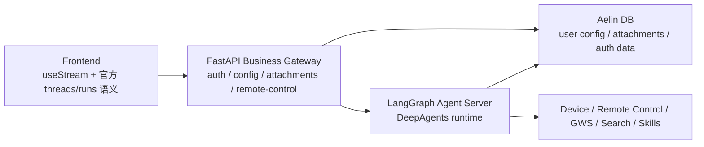

# DeepAgents Agent Server 重构方案（2026-03-27）

## 目标

- 把 Aelin 从“FastAPI 自定义 agent 壳 + DeepAgents 内核”重构成“LangGraph / DeepAgents 标准运行时 + 极薄业务网关”。
- 明显减少功能代码量，优先删除自定义流式协议、运行时状态拼装、重复的前端转换层。
- 保留并稳定以下现有能力：
  - `remote-control`
  - 用户级 LLM 配置（provider / model / base_url / api_key / verify_ssl）
  - attachment 上传与检索
  - workspace 语义
  - device / files / web_search / gws / skills

## 结论

应该直接重构，不应该继续修补当前自定义 agent 壳。

根因不是某一个 timeout 或某一个 SSE bug，而是现在的职责边界错了：

- DeepAgents / LangGraph 负责的运行时、thread、run、stream、subagent、todo、queue 语义，被 Aelin 的 FastAPI 路由层重新实现了一遍。
- 这导致我们一直在维护一个“近似官方但并不原生”的运行时壳。
- 典型后果就是：
  - `deepagents_run_idle_timeout` 这种外层误判
  - tool / subagent / graph 事件有信息损耗
  - 前端 `useStream` 前又多了一层 transport / adapter / timeline 转换
  - 修一个流式问题，经常又冒出另一个壳层契约问题

## 官方形态应该是什么

参考官方资料：

- [DeepAgents Overview](https://docs.langchain.com/oss/python/deepagents/overview)
- [DeepAgents Frontend Overview](https://docs.langchain.com/oss/python/deepagents/frontend/overview)
- [LangGraph Agent Server](https://docs.langchain.com/langsmith/agent-server)
- [LangGraph Enqueue Concurrent](https://docs.langchain.com/langsmith/enqueue-concurrent)
- [DeepAgents GitHub](https://github.com/langchain-ai/deepagents)

官方推荐形态本质上是两层：

1. Agent runtime 层

- `create_deep_agent(...)`
- LangGraph runtime / Agent Server
- 官方 thread / run / queue / stream 语义
- 官方 `useStream`

2. Product business 层

- 用户鉴权
- 用户配置管理
- attachment 上传
- remote-control HTTP API
- device / workspace / 自定义业务工具接入

关键点不是“去掉 FastAPI”，而是“FastAPI 不再承担 agent runtime 本身”。

## Aelin 的目标架构

### 职责切分

#### LangGraph Agent Server 负责

- assistant / graph 注册
- thread / run / stream / queue
- subagents / todos / messages / values
- checkpoint / durable execution
- multitask / enqueue / cancel

#### FastAPI 负责

- 登录鉴权与用户身份解析
- `/api/v1/agent/config` 与 `/api/v1/agent/test`
- attachment 上传与元数据管理
- remote-control 独立 HTTP API
- 给 Agent Server 提供“用户配置 / 工具运行所需业务上下文”
- 可选：做一个极薄反向代理，给前端统一同源入口

## 必须保留的能力

### 1. 用户配置 LLM

保留现状的产品入口：

- `GET /api/v1/agent/config`
- `PATCH /api/v1/agent/config`
- `POST /api/v1/agent/test`

但运行时接法要改：

- 不再由 `backend/app/routers/deepagents_chat.py` 手动创建 chat model 并流式转发。
- 改成 Agent Server 在 run 启动时，根据认证用户和 workspace 解析 DB 里的 LLM 配置。
- 前端不直接保管 secret，只提交 thread/run 请求；后端根据当前用户注入 model config。

建议做法：

- 提取一个纯 resolver：
  - `resolve_user_llm_config(user_id, workspace) -> model settings`
- Agent Server graph 入口统一调用它。
- `agent/test` 继续保留，作为独立诊断接口。

### 2. remote-control

必须双保留：

- 继续保留独立 HTTP API，方便手动触发和外部 bot / webhook 接入。
- 同时把同一套核心能力以 tool 形式提供给 DeepAgents runtime。

建议做法：

- 让 `remote_control.py` 成为唯一业务内核。
- HTTP router 和 DeepAgents tool 只调用这一层。
- 这样不会因为 Agent Server 化而丢功能，反而会更干净。

### 3. attachment / device / skills

这些都不需要留在自定义 chat 壳里：

- attachment 上传：继续走 FastAPI 业务接口
- attachment 检索：作为 graph tool
- device / screen_get / remote-control：作为 graph tool
- skills：继续由 graph 装配时挂载

## 代码量为什么会少很多

当前真正最厚、最重复的部分，不是业务功能，而是“自定义运行时胶水”。

### 预计可以明显收缩的区域

后端：

- `backend/app/routers/deepagents_chat.py`
  - 现约 657 行
  - 绝大部分是自定义 SSE 事件序列化、进度判定、worker 生命周期管理
- `backend/app/services/deepagents/deepagents_graph.py`
  - 现约 961 行
  - 其中一部分保留，但“为旧壳补契约”的部分应继续收缩
- 自定义 idle/progress/tool-event 推断逻辑
- 围绕旧 stream 壳写出的壳层测试

前端：

- `frontend/src/features/chat/hooks/deepagentsUseStreamTransport.ts`
  - 现约 305 行
  - 应尽量删除或缩到极薄代理
- `frontend/src/features/chat/hooks/useChatStream.ts`
  - 现约 292 行
  - 其中不少是围绕自定义 transport 和 optimistic sync 的补层
- `frontend/src/features/chat/executionStreamUtils.ts`
  - 现约 618 行
  - 这是最大可削减点之一
- Execution pane 里围绕自定义 timeline / graph 补结构的代码

### 保守估算

以当前功能代码粗算，`backend/app + backend/tests + frontend/src` 约 `20937` 行。

如果把 agent runtime 彻底迁到官方边界，同时清掉旧 SSE / adapter / timeline glue，保守看可以净减：

- `1500` 到 `3000` 行功能代码

这还没算后续继续删除旧兼容测试与重复状态管理的空间。

## 重构原则

### 原则 1

不再手写“仿官方 runtime”。

### 原则 2

FastAPI 只做 business API / auth gateway，不做 agent orchestration。

### 原则 3

前端直接消费官方 thread / run / stream 语义，不再自己发明第二套阶段协议。

### 原则 4

同一个业务能力只能有一个核心实现。

例子：

- remote-control 的核心逻辑只能在一处
- LLM 配置解析只能在一处
- attachment 检索只能在一处

## 实施方案

## Phase 1：拆边界，不先碰所有 UI

- 新建 Agent Server app，注册 `assistant_id=agent`
- graph 直接使用 DeepAgents
- 把当前 `build_chat_agent`、tools、memory、skills 挪到 Agent Server graph 入口
- 保留 FastAPI 的：
  - auth
  - agent config
  - agent test
  - attachments
  - remote-control
  - device 辅助接口

交付标准：

- 能在 Agent Server 里跑通同样的 DeepAgents graph
- 不再依赖 `deepagents_chat.py` 去驱动 run 生命周期

## Phase 2：用户配置与业务上下文注入标准化

- 提取统一 resolver：
  - 用户身份
  - workspace
  - LLM config
  - attachments 上下文
  - 工具 runtime context
- Agent Server 入口只吃标准化后的 config / context
- 不允许前端把 provider secret 直接塞给 runtime

交付标准：

- 每个 run 都能基于当前用户拿到正确 model/provider/base_url/ssl 设置
- remote-control / attachments / tools 继续可用

## Phase 3：前端改成官方 useStream 主路径

- 让前端直接对接 Agent Server 的 thread/run/stream 语义
- 删掉大部分自定义 transport 适配
- 优先直接使用：
  - `stream.messages`
  - `stream.subagents`
  - `stream.values.todos`
- 右侧执行面板直接基于官方 stream 数据显示，不再从自定义 timeline 二次推导

交付标准：

- 聊天仍流式输出
- tool / subagent / todo 可见
- graph / pane 数据直接来源于官方 stream，而不是自定义推断层

## Phase 4：保留业务 API，但把 chat 壳削成极薄网关或直接删掉

两种都可以，推荐第二种：

1. 极薄同源代理

- FastAPI 仅做 auth 校验和 header/context 转发
- 不解析 stream body
- 不重写 SSE event

2. 前端直连 Agent Server

- 最原生
- 但需要把鉴权、CORS、部署路由一次性理顺

建议先做 1，再评估是否做 2。

原因：

- 1 已经能消灭当前最大的问题源
- 风险比直接改全量部署小
- 代码也会明显减少

## Phase 5：集中删除旧代码

目标是彻底删掉这些“运行时壳代码”：

- 自定义 `/api/v1/deepagents/chat/stream` worker / queue / idle timeout 壳
- 自定义 SSE event 转译
- 前端 `deepagentsUseStreamTransport.ts` 中的协议补层
- `executionStreamUtils.ts` 中仅用于自定义 graph/timeline 推断的部分
- 与旧壳强耦合的测试

## 需要删除或收缩的重点文件

### 后端

- `D:\Github\Aelin\backend\app\routers\deepagents_chat.py`
  - 目标：删除或缩成极薄反向代理
- `D:\Github\Aelin\backend\app\services\deepagents\deepagents_graph.py`
  - 目标：保留 graph 装配，删除为旧壳服务的补层
- `D:\Github\Aelin\backend\tests\test_deepagents_shell.py`
  - 目标：改成 Agent Server / gateway 形态下的新测试

### 前端

- `D:\Github\Aelin\frontend\src\features\chat\hooks\deepagentsUseStreamTransport.ts`
  - 目标：删除或极薄化
- `D:\Github\Aelin\frontend\src\features\chat\hooks\useChatStream.ts`
  - 目标：只保留产品状态，不再做协议修补
- `D:\Github\Aelin\frontend\src\features\chat\executionStreamUtils.ts`
  - 目标：大幅删除，直接吃官方 stream 数据
- `D:\Github\Aelin\frontend\src\features\chat\components\ExecutionPane.tsx`
  - 目标：改成直接展示 subagents / todos / tool calls

## 风险与对应策略

### 风险 1：remote-control 被迁移过程误伤

策略：

- 不改业务内核，只改接线方式
- 保持独立 HTTP API 全程可用
- DeepAgents tool 与 HTTP API 共享一套 service

### 风险 2：用户 LLM 配置丢失或 secret 暴露

策略：

- 配置管理接口不变
- runtime 只后端读取 DB，不让前端持有 secret
- `agent/test` 作为回归验证口保留

### 风险 3：前端一次性全改过大

策略：

- 先保留现有页面布局
- 先换数据来源，再换呈现组件
- 先收掉 transport / stream adapter，再重画 graph

## 验收标准

- 流式聊天继续可用
- `remote-control` 可继续独立调用，也可由 agent 调用
- 用户在设置页修改 provider / model / base_url / api_key / verify_ssl 后，新 run 生效
- attachment 上传与检索继续可用
- tool / subagent / todo 在前端可见
- 不再出现当前这种由外层壳误判导致的 `deepagents_run_idle_timeout`
- 删除大部分自定义 SSE / adapter / timeline glue 后，功能代码净减少

## 我的建议

这件事值得做，而且应该直接作为下一阶段主线，而不是继续给当前自定义 chat 壳打补丁。

最合适的路线是：

1. 先落 Agent Server 运行时边界
2. 保留 FastAPI 业务 API
3. 前端改为更原生的 `useStream`
4. 最后集中删除旧壳和冗余测试

这样既不会丢 `remote-control` 和用户 LLM 配置，也最符合你要的“更标准、更干净、代码更少”。
